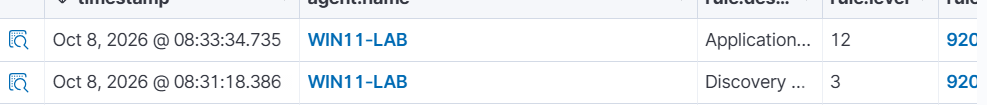
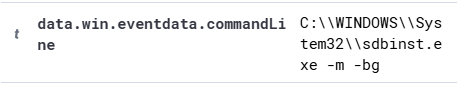
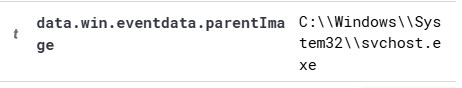
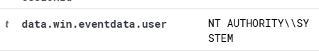
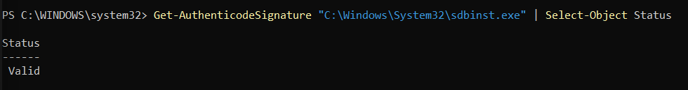

## 1. Incident Overview

A high-severity alert (Level 12) was detected by Wazuh on the Windows 11 lab machine (WIN11-LAB).

The alert involved the execution of `sdbinst.exe`, a Windows system utility. The purpose of this investigation was to determine whether the activity was suspicious or legitimate.

## 2. Detection Evidence

- **Detection Tool:** Wazuh
- **Endpoint:** WIN11-LAB
- **Alert Level:** 12
- **Alert Description:** Application Compatibility Database launched
- **Sysmon Event ID:** 1 (Process Creation)
- **Process:** `C:\Windows\System32\sdbinst.exe`
- **Command Line:** `C:\Windows\System32\sdbinst.exe -m -bg`
- **Parent Process:** `C:\Windows\System32\svchost.exe`
- **User:** `NT AUTHORITY\SYSTEM`

## 3. Investigation and Analysis

The following findings were identified during the investigation:

- The process `sdbinst.exe` was executed from the Windows System32 directory.
- The parent process was `svchost.exe`.
- The process ran under the `NT AUTHORITY\SYSTEM` account.
- Digital signature verification returned `Valid`.
- The file metadata identified Microsoft Corporation as the company.

These findings suggest that the activity may be legitimate. However, a valid digital signature alone does not guarantee that the activity is harmless.

## 4. Final Verdict

**Classification:** Likely Benign — Further Validation Recommended

**Reasoning:**

The process was executed from a standard Windows system directory, and its digital signature was valid.

No direct evidence of malicious activity was identified during this investigation. However, additional validation would be required before definitively classifying the activity as benign.

**Status:** Investigation Completed

## 5. Investigation Screenshots

### 1. Wazuh Alert

### 2. Command Line

### 3. Sysmon Event ID

### 4. Parent Process

### 5. Process User

### 6. Digital Signature Verification

## 6. Lessons Learned

- Investigated a security alert using Wazuh and Sysmon.
- Analyzed process creation events, command-line arguments, parent processes, and user context.
- Verified the digital signature of a Windows executable.
- Learned that a high-severity alert does not necessarily indicate malicious activity.
- Documented investigation findings and supporting evidence.

## 7. Tools Used

- Wazuh SIEM
- Microsoft Sysmon
- Windows PowerShell
- Windows 11
- Oracle VirtualBox

**Lab Type:** Personal SOC Home Lab